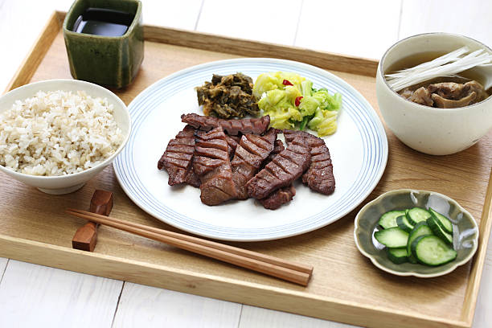

# 概要
大学の企画でチームを組み、初めてのWebアプリ開発に挑戦し大学の食堂の売り切れ情報を管理するアプリを開発しました。この時Firebaseを利用することで、サーバーの設定をしなくてもデータベースを利用することができ、開発に役立ちました。

　
[実際の作品(リンク)](https://lunchnotification-7bc60.web.app)

この記事では、開発で使用した言語・技術、実際のコードを見ながら解説していきます。

# 1. はじめに
## チームメンバーの紹介
私たちは、経営学部の3年生1人と私を含めた2年生の同期3人でチームを組みました。
プログラミングに少し触れたことはあったものの、私と3年生の先輩が他の2人よりも知識があったため、主にエンジニアを担当することになりました。

しかし、後に行われるハッカソンには、3年生の先輩が気胸が再発し参加できなくなったため、同期の1人にデザイナーとエンジニアを兼任してもらうことになりました。

基本的にHTML,CSSはA先輩とBくんで行い、Firebase関係のことは私が実装しました。この時にFirebase等様々な知識を教えて下さったエンジニアとして働いているUさんは一生忘れません。ありがとうございました。

|名前(仮名)|役割|
|:-|:-|
|私|リーダー兼エンジニア|
|A先輩|エンジニア|
|Bくん|デザイナー兼エンジニア|
|Cくん|資料作成|
|Uさん|師匠|

## アプリ開発のきっかけとなったハッカソン参加の経験
今回参加したハッカソンは「SPAJAM2022京都大会」です。<br>
このハッカソンでは、<b>アプリを開発の流れを知る</b>ということが目的でした。
参加した2日間で実際に学びになった項目を以下に示します。

<dl>
<dt>・アイデア出し</dt>
    <dd>◦ お題に関係するものをマンダラートのように書き出す。</dd>
    <dd>◦ お題に関する感情を喜怒哀楽で書き出す。</dd>
    <dd>◦ 書き出した関連ワードと感情から、アイデアを創造して具体的にそしてできるだけ書き出す。</dd>
<dt>・開発日程</dt>
    <dd>◦ 会場1日目を全てアイデア出しに使い、帰宅し半日で制作</dd>
<dt>・開発手法</dt>
    <dd>◦ Flutter,Firebase</dd>
    <dd>◦ ハードウェア</dd>
<dt>・発表方法</dt>
    <dd>◦ 動画の使用</dd>
    <dd>◦ 発表順番の設定(私のハッカソンでの発表はデモ→開発理由→構成図)</dd>
</dl>

# 2. アプリのアイデアと開発内容
## アプリのアイデアの背景
このアプリのアイデアは、大学の食堂に関する問題を解決しようとしたことがきっかけです。具体的には、以下の問題点がありました。

<dl>
    <dt>①いつ買っても使える食券(←偽造し放題やんけ)</dt>
    <dt>②食堂に行かなければ売切れかどうか分からない。</dt>
    <dt>③食事の提供を停止してから券売機が停止されるため、当日朝に購入しても利用できない。</dt>
</dl>

これらの問題点のうち、①については学生側では解決できないため、今回のアプリ開発では、②を解決することに注力しました。

②の問題は、教職員の方々にとっても課題となっていた。というのも、教職員の休憩時間は学生よりも遅く、食堂のメニューは早い時間帯に売り切れてしまうことが多いためです。そのため、休憩時間を有効に使うためには、食堂に行く前にメニューの在庫を確認できる方法が必要だと考えました。

## 使用した言語・技術の紹介
<dl>
<dt>・使用した言語・技術の紹介</dt>
    <dd>◦ HTML: HTML5</dd>
    <dd>◦ CSS: CSS3</dd>
    <dd>◦ JavaScript: ECMAScript 6</dd>
    <dd>◦ Firebase: Firebase Authentication、Firebase Firestore Database</dd>
<dt>・使用した目的</dt>
    <dd>◦ HTML、CSS、JavaScript: フロントエンド開発</dd>
    <dd>◦ Firebase: バックエンドの機能を提供するため</dd>
</dl>
<h2>Firebaseのデータベース構造</h2>

```
admin (collection)
  ├ {admin_email} (document)
  │  └ email: string (管理者のGmailアドレス)
menu (collection)
  ├ {menu_id} (document)
  │  └ stock: boolean (在庫があるかどうか)
  ├ {menu_id} (document)
  │  └ stock: boolean (在庫があるかどうか)
  └ {menu_id} (document)
     └ stock: boolean (在庫があるかどうか)
```
データベース設計をされている方は<b>発狂しそうなデータ構造</b>をしていると今更ながら思います。食堂のメニューが少なく、やりたいこととしてはこれくらいでも達成できることからこのままです。
{menu_id}に直接商品名を入れているところがミソです。

後の解説で、collection(コレクション)document(ドキュメント)という言葉は出てくるので覚えといてください。

Firestoreについて少し知りたい方は、こちらの記事を見て頂ければと思います。
どちらも初めのほうの記事を読むと分かるようになっています。

https://cloud.google.com/firestore/docs?hl=ja

https://zenn.dev/yucatio/articles/173f386c471398

https://qiita.com/azukiazusa/items/2cb7405c47ac38fa3fd1

流行りのchatGPTにかけてみると以下のようなものを出力してくれました。
```
admins (collection)
  ├ {admin_email} (document)
  │  └ email: string (管理者のGmailアドレス)
menus (collection)
  ├ {menu_id} (document)
  │  ├ name: string (メニューの名前)
  │  └ stock: boolean (在庫があるかどうか)
  ├ {menu_id} (document)
  │  ├ name: string (メニューの名前)
  │  └ stock: boolean (在庫があるかどうか)
  └ {menu_id} (document)
     ├ name: string (メニューの名前)
     └ stock: boolean (在庫があるかどうか)
```
初心者だけど同じ様なものを作りたい、作ってみたいという方はchatGPTくんが作成したものを使ってみるのもいいかもしれませんね。

# 3. コードの全文・解説
## HTML/CSSのコード全文
この章では、A先輩とBくんが作成したコードを見ます。
私がFirebaseを導入する時に、少し変更していますが、殆ど原文ママなのでそのまま残していきます。

### HTMLのソースコード


```index.html

<!DOCTYPE html>
<html lang="ja">

<head>
    <meta charset="UTF-8">
    <meta http-equiv="X-UA-Compatible" content="IE=edge">
    <meta name="viewport" content="width=device-width,initial-scale=1.0">
    <link rel="stylesheet" href="./styles/index.css">
    <title>Document</title>
</head>
<main>

    <body onload="anonymousLogin() && firstStateFoodmenu()">

        <script src="/__/firebase/9.6.6/firebase-app-compat.js"></script>
        <script src="/__/firebase/9.6.6/firebase-auth-compat.js"></script>
        <script src="/__/firebase/9.6.6/firebase-firestore-compat.js"></script>
        <script src="/__/firebase/init.js"></script>
        <script src="./scrips/reload.js"></script>
        <script src="./scrips/firstStateFoodmenu.js"></script>
        <script src="./scrips/lunchNotification.js"></script>
        <script src="./scrips/onClickFoodButton.js"></script>


        <h1>lunch menu</h1>
        <!-- <button id="btn" onclick="location.href='Admin.html'">Login</button> -->
        <a class="btn btn--yellow btn--cubic" onclick="doReloadNoCache()">更新</a>
        <div id="classic">
            <div class="food">
                <div id="DailyLunch" class="food2" style="visibility: visible;">
                    
                </div>
                <h4>日替わり定食　800円</h4>
            </div>

            <div class="food">
                <div id="FriedChicken" class="food2" style="visibility: visible;">
                    
                </div>
                <h4>唐揚げ定食　800円</h4>
            </div>

            <div class="food">
                <div id="Syouga" class="food2" style="visibility: visible;">
                    
                </div>
                <h4>生姜焼き定食　800円</h4>
            </div>

            <div class="food">
                <div id="Tonkatu" class="food2" style="visibility: visible;">
                    
                </div>
                <h4>とんかつ定食　800円</h4>
            </div>

            <div class="food">
                <div id="Hamburge" class="food2" style="visibility: visible;">
                    
                </div>
                <h4>ハンバーグ定食　800円</h4>
            </div>

            <div class="food">
                <div id="Sashi" class="food2" style="visibility: visible;">
                    
                </div>
                <h4>刺身定食　1000円</h4>
            </div>
        </div>
    </body>
</main>

</html>
```


### CSSのソースコード

```index.css
@import url('https://fonts.googleapis.com/css2?family=Itim&display=swap');

body{
    background-color: beige;
}

main{
    width: 480px;
    overflow: hidden;
}

h1{
    width: 470px;
    margin-top: 0;
    font-size: 80px;
    font-family: 'Itim', cursive;
    color: white;
    text-align: center;
    background-color: yellowgreen;
    border-radius: 5px; 
}

h4{
    width:210px;
    
    margin-bottom: 10px;
    font-size: 15px;
    line-height: 60px;
    color: white;
    text-align: center;
}

#classic{
    clear: both;
    justify-content: center;
}

.food{
    width: 210px;
    height: 280px;
    padding: 10px;
    margin-bottom: 10px;
    margin-right: 5px;
    margin-left: 2.5px;
    border-radius: 5px;
    background-image: url(../img/sold_1.png);
    background-position: top;
    background-repeat: no-repeat;
    background-color: burlywood;
    float:left;
    text-align: center;   
}

.food2{
    width: 180px;
    padding: 10px;
    margin-bottom: 10px;
    margin-right: 5px;
    margin-left: 5px;
    border-radius: 5px;
    background-color: burlywood;
    float:left;
}

img{
    width: 100%;
}

div#gyu{
    visibility: visible;
}

a { 
    color:black; 
    text-decoration:none; 
}

.btn,
a.btn,
button.btn {
    font-size: 1.6rem;
    font-weight: 700;
    line-height: 1.5;
    position: relative;
    display: inline-block;
    padding: 1rem 4rem;
    cursor: pointer;
    -webkit-user-select: none;
    -moz-user-select: none;
    -ms-user-select: none;
    user-select: none;
    -webkit-transition: all 0.3s;
    transition: all 0.3s;
    text-align: center;
    vertical-align: middle;
    text-decoration: none;
    letter-spacing: 0.1em;
    color: #212529;
    border-radius: 0.5rem;
    margin-bottom: 5px;
}
a.btn--yellow {
    color: #000;
    background-color: #fff100;
    border-bottom: 5px solid #ccc100;
}  
a.btn--yellow:hover {
    margin-top: 3px;
    color: #000;
    background: #fff20a;
    border-bottom: 2px solid #ccc100;
}
```


## JSのコード解説

### JSのソースコードと解説①

#### コード全文

```firstStateFoodmenu.js

function onInitPage(){
    Login();
    firstStateFoodmenu();
}
async function Login(){
    const provider = new firebase.auth.GoogleAuthProvider();
    provider.addScope('https://www.googleapis.com/auth/contacts.readonly');
    await firebase.auth().signInWithPopup(provider)

}
async function anonymousLogin(){
    await firebase.auth().signInAnonymously();
}
async function Logout(){
    await firebase.auth().signOut();
}
async function firstStateFoodmenu() {
    const foodElements = document.getElementsByClassName('food2');
    // 取得した要素の数を取得
    const len = foodElements.length;
    console.log(len);
    // console.log(foodElements);

    const menuCollectionRef = db.collection('menu');
    const foodDocs = await menuCollectionRef.get();
    const foodinfos = foodDocs.docs.map(snapshot => {
        return { docId: snapshot.id, data: snapshot.data() };
    });

    foodinfos.forEach(info => {
        const elem = document.getElementById(info.docId);
        if (info.data.stock) {
            elem.style.visibility = "visible";
            console.log(info.docId);
            console.log(info.data);
        } else {
            elem.style.visibility = "hidden";
            console.log(info.docId);
            console.log(info.data);
        }
    });
};

```

#### コード解説

```firstStateFoodmenu.js

function onInitPage(){
    Login();
    firstStateFoodmenu();
}

```

関数`onInitPage()`は、ページの初期化時に呼び出されます。
この関数は、まずFirebaseのGoogle認証プロバイダを使用して、ユーザーのログインを試みます。その後、`firstStateFoodmenu()`関数を呼び出して、Firestoreからメニューデータを取得してWebページに表示します。

```firstStateFoodmenu.js

async function Login(){
    const provider = new firebase.auth.GoogleAuthProvider();
    provider.addScope('https://www.googleapis.com/auth/contacts.readonly');
    await firebase.auth().signInWithPopup(provider)

}

```

関数`Login()`は、Google認証プロバイダを使用して、Firebaseの認証システムにユーザーをログインさせます。この関数では、ユーザーのGoogleアカウントから連絡先情報を読み取ることが許可されます。

```firstStateFoodmenu.js

async function anonymousLogin(){
    await firebase.auth().signInAnonymously();
}

```
関数`anonymousLogin()`は、匿名ユーザーとしてFirebaseにログインします。これは、ユーザーがGoogleアカウントを持っていない場合や、Googleアカウントを使用したログインが必要ない場合に使用されます。

```firstStateFoodmenu.js

async function Logout(){
    await firebase.auth().signOut();
}

```

関数`Logout()`は、Firebaseからユーザーをログアウトします。

```firstStateFoodmenu.js

async function firstStateFoodmenu() {
    const foodElements = document.getElementsByClassName('food2');
    // 取得した要素の数を取得
    const len = foodElements.length;
    console.log(len);
    // console.log(foodElements);

    const menuCollectionRef = db.collection('menu');
    const foodDocs = await menuCollectionRef.get();
    const foodinfos = foodDocs.docs.map(snapshot => {
        return { docId: snapshot.id, data: snapshot.data() };
    })

    foodinfos.forEach(info => {
        const elem = document.getElementById(info.docId);
        if (info.data.stock) {
            elem.style.visibility = "visible";
            console.log(info.docId);
            console.log(info.data);
        } else {
            elem.style.visibility = "hidden";
            console.log(info.docId);
            console.log(info.data);
        }
    });
};

```

関数`firstStateFoodmenu()`は、Firestoreからメニューデータを取得して、Webページ上に表示します。この関数は、`Firestoreのmenuコレクションからデータ`を取得し、各ドキュメントの在庫情報に基づいて、Webページ上のメニューアイテムの表示/非表示を切り替えます。

<b>コードが長いため少し分割して解説します。</b>

```firstStateFoodmenu.js

const foodElements = document.getElementsByClassName('food2');
    // 取得した要素の数を取得
    const len = foodElements.length;
    console.log(len);
    // console.log(foodElements);

```

<b>1行目</b>では、documentオブジェクトの`getElementsByClassName()`メソッドを使用して、クラス名が`"food2"`であるすべてのHTML要素を取得しています。このメソッドは、引数に指定されたクラス名を持つすべての要素をHTMLCollectionオブジェクトとして返します。HTMLCollectionは配列のようにインデックス番号でアクセスできます。

https://developer.mozilla.org/ja/docs/Web/API/Document/getElementsByClassName

<b>2行目</b>では、取得したHTML要素の数を、`foodElements.length`プロパティで取得して、変数`len`に格納しています。この変数は、後で処理で使用するために取得されています。

<b>3-4行目</b>では、取得した要素の数を<b>デバック用</b>にコンソールに出力しています。`console.log()`メソッドを使用して、lenを出力することで、取得したHTML要素の数が表示されます。また、foodElements自体を出力することで、取得したHTML要素が配列のように表示されます。

```firstStateFoodmenu.js

    const menuCollectionRef = db.collection('menu');
    const foodDocs = await menuCollectionRef.get();
    const foodinfos = foodDocs.docs.map(snapshot => {
        return { docId: snapshot.id, data: snapshot.data() };
    })

```

<b>1行目</b>では、`menu`という名前のコレクションを参照するために、Firestoreのdbオブジェクトの`collection()`メソッドを使用して、`menuCollectionRef`という変数にコレクションの参照を代入しています。

<b>2行目</b>では、`menu`コレクション内のすべてのドキュメントを取得するために、`menuCollectionRef`オブジェクトの`get()`メソッドを呼び出し、その結果を`foodDocs`という変数に代入しています。
`get()`メソッドは非同期で実行されるため、`await`キーワードを使用して、`foodDocs`<b>がFirestoreから正常に取得された後に、次の行の処理に進むようにしています。</b>


https://cloud.google.com/firestore/docs/query-data/get-data?hl=ja


<b>3行目</b>では、`foodDocs`オブジェクトの`docs`プロパティを使用して、`QueryDocumentSnapshot`オブジェクトの配列を含む`foodDocs.docs`という配列を作成します。この配列の各要素は、Firestoreの各ドキュメントを表し、`QueryDocumentSnapshot`オブジェクトには、ドキュメントIDやドキュメント内のフィールドなどの情報が含まれています。

<b>4行目</b>では、配列の`map()`メソッドを使用して、`foodDocs.docs`の各要素に対して処理を行い、新しい配列`foodinfos`を作成しています。ここで、配列の`map()`メソッドは、各要素に対して指定された関数を適用して、新しい配列を作成するメソッドです。

https://developer.mozilla.org/ja/docs/Web/JavaScript/Reference/Global_Objects/Array/map

この場合、各`QueryDocumentSnapshot`オブジェクトの`docId`プロパティと`data`プロパティを含む新しいオブジェクトを作成して、`foodinfos`に追加しています。`docId`プロパティには、ドキュメントのIDが、`data`プロパティには、ドキュメント内のデータが含まれます。
このようにして、Firestoreから取得したメニューデータをJavaScriptのオブジェクトの配列に変換し、処理しやすくしています。

### JSのソースコードと解説②

```lunchNotification.js

const db = firebase.firestore();
db.collection('menu')
  .limit(20)
  .onSnapshot((snapshot) => {
    let items=[];
    console.log("Snapshot：検知しました。");

    window.onpageshow = function(event) {
      if (event.persisted) {
        console.log("Leroad：リロード。");
        window.location.reload();
      }
  };
  
},err => console.log(err));

```
</details>

このコードはFirebase Cloud Firestoreを使用して、データベースの `menu`コレクションから最大20件のデータを取得し、変更があった場合にリアルタイムで更新を行うためのものです。

具体的には、`onSnapshot`メソッドを使用して、`menu`コレクションの変更を監視し、変更がある度にコールバック関数を呼び出します。このコールバック関数では、取得したデータを `items` 配列に格納し、console.logを使ってメッセージを出力します。

また、このコードでは、`window.onpageshow`を使用して、ページをリロードするようにしています。これは、ブラウザでページを更新すると、コールバック関数が再度呼び出され、最新のデータを取得することができるためです。

最後に、エラーが発生した場合は、コンソールにエラーメッセージを出力するようになっています。

https://firebase.google.com/docs/firestore/query-data/listen?hl=ja#on_snapshot

### JSのソースコードと解説③

```onClickFoodButton.js

async function onClickFoodButton(id) {
    const elem = document.getElementById(id);
    const lunchRef = db.collection('menu').doc(id);
    const foodDoc = await lunchRef.get();
    // if(foodDoc.exists){
        console.log(foodDoc.data());
        const foodData = foodDoc.data();
    //}
    if(foodData.stock){  //stock===true
        elem.style.visibility = "hidden";
        lunchRef.set({stock: false});
        console.log(lunchRef);
    }else{
        elem.style.visibility = "visible";
        lunchRef.set({stock: true});
        console.log(lunchRef);
    }   
}

```

この関数では、次の処理が行われます。

1.引数で渡されたIDをもとに、対応するHTML要素を取得します。
2.Cloud Firestore データベースから、IDに対応するドキュメントを取得します。
3.取得したドキュメントが存在する場合は、そのドキュメントのデータをコンソールに表示します。
4.取得したドキュメントから、`stock`というフィールドを取得し、その値が `true` である場合、HTML要素を非表示に設定します。その後、`stock` フィールドの値を `false` に更新し、更新したドキュメントを保存します。
5.取得したドキュメントから、`stock`フィールドを取得し、その値が `false` である場合、HTML要素を表示に設定します。その後、`stock`フィールドの値を`true`に更新し、更新したドキュメントを保存します。

この関数は、Cloud Firestoreのデータを更新するために使用されます。具体的には、`menu`コレクションの中にある、各料理に対応するドキュメントの`stock`フィールドの値を更新します。`stock`フィールドの値が`true`であれば、対応する料理の在庫があることを表し、HTML要素を非表示にすることで、在庫がないことをユーザーに伝えます。`stock`フィールドの値が`false`であれば、在庫がないことを表し、HTML要素を表示することで、在庫があることをユーザーに伝えます。

### JSのソースコードと解説④

```reload.js

function doReloadNoCache() {
    // キャッシュを無視してサーバーからリロード
    window.location.reload();
};

```
この関数は、`window.location.reload()` を呼び出すことで、現在のURLをリロードし、ページを更新します。しかし、通常、ブラウザはページのコンテンツをキャッシュするため、`window.location.reload()` を単純に呼び出すだけでは、古いキャッシュが使用されてしまう場合があります。この関数は、そのような問題を回避するために、キャッシュを無視してページをリロードするためのものです。

ここのコードは`window.addEventListener()`などで、ページが読み込まれたときに実行するように変更することが良いと思われます。

```
window.addEventListener('load', function() {
  doReloadNoCache();
});

```

しかし、キャッシュを利用しないことでサイトを開く速度が遅くなったり、サーバーに負荷がかかったりするため一概に良い方法とは言えないかもしれません。

## Firebaseのセキュリティコード解説

公式ドキュメントや次の動画を参考にすると良いでしょう。

https://firebase.google.com/docs/firestore/security/get-started?hl=ja

https://fireship.io/snippets/firestore-rules-recipes/

簡単なものですが、今回のコード例です。

```Firebase Rule

rules_version = '2';

// Allow read/write access on all documents to any user signed in to the application
service cloud.firestore {
  match /databases/{database}/documents {
    match /menu/{document=**}{
      allow read: if request.auth != null && request.auth.uid != "xxxxx";
      allow read,write: if request.auth != null && request.auth.uid == "xxxxx";
    }
  }
}

```

JSコード解説①を実行した場合の`UID(uid)`はFirebaseの`Authentication`で確認することができます。

また、Firebaseの公式ドキュメントでは<b>次のコードでuidを取得できる</b>と記述されています。

```getAuth.js

getAuth()
  .getUser(uid)
  .then((userRecord) => {
    // See the UserRecord reference doc for the contents of userRecord.
    console.log(`Successfully fetched user data: ${userRecord.toJSON()}`);
  })
  .catch((error) => {
    console.log('Error fetching user data:', error);
  });

```

https://firebase.google.com/docs/auth/admin/manage-users?hl=ja

# 4. まとめ
## アプリ開発の反省点と評価点

今回の開発において反省点はいくつもあるが、今書いているなかで一番思うことは知識が不足しているので、反省すべき点も抽象的な事ばかりになってしまうことだった。抽象的なことでも３つ書き出して考えてみる。

`反省点`
<b>・技術トレンドを知らない </b>
　(今回の場合だとFirebaseというやり方があったが、サーバを用意する方法だけを考えていた)
<b>・コーディングに対する知識不足</b>
　(Uさんに教えてもらうまでは、変数のキャメルケースを知らなかった)
　(単純に英単語の引き出しが悪く、変数名をより良い形でつけることが出来なかった)
　(async/awaitなど非同期処理の理解など、限られた技術の中でモノを作ることだけを考えていた)
<b>・チームメンバーの管理と成長機会の創出</b>
　(メンバー全員に達成感を味わってもらうことが出来なかった)
　(特にCくんは、私が工程を進めることを考えていたため発表の機会などを奪ってしまった)
 
`評価点`
<b>・やりきった</b>
<b>・アウトプットをした事が足りないことへの気付きへと繋がった</b>
<b>・bくんには次もやってみたいと言ってもらえた</b>

## 今後の展望

今回のプロジェクトとしては、成功と言えるのではないかと個人的には思っている。
その理由はハッカソンややり遂げることを通じて、エンジニアとして少し前進したと感じたからです。

そのため、今後の展望としては安直かもしれないが身近な課題と自分たちの創造性を織り交ぜて、定期的にアプリ開発をしていきたいと思う。所属しているゼミ内でも2,3年の合同でハッカソンなどを行う計画もあるらしいので、少しでもチームで開発し経験を積んでいきたいと思いました。

また記事も修正できる箇所を見つけ次第、随時修正できたらと思います。

# 5.終わりに

ここまで記事を読んで下さりありがとうございます。

初めての記事作成ということで、どの様に書けば良いか分からず何となく書いてみましたがどうでしたか？
このプロジェクトで、チームで開発するという経験と自分が想像したアプリを開発することはとても楽しいことだと改めて実感することができました。皆さんも機会があればチームを組んでアプリだけではなく、何かを達成する喜びというものを知っていただけらと思います。

今後も、私やこの記事を読んでいる皆様に役立つ記事や面白い記事を提供出来ればと思います。

